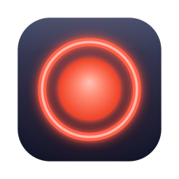

  

<h1 align="center">Huemdal</h1>

English | [日本語](README.ja.md)

A macOS app that changes the state of your Philips Hue lights based on camera usage, and restores them to their previous state when the camera is no longer in use.
During remote meetings and the like, it lets your family know "please don't come in right now."

## Requirements

- macOS 14 (Sonoma) or later
- Philips Hue Bridge v2

## Install

Download the latest `Huemdal-<version>.zip` from [Releases](https://github.com/shinespark/huemdal/releases), unzip it, and move `Huemdal.app` to your Applications folder. Release builds are signed with a Developer ID and notarized by Apple, so they launch without any Gatekeeper workarounds.

## Setup

1. Launch Huemdal — it appears in the menu bar
2. Open menu > **Settings…** (**Set Up…** when unconfigured)
3. In the **Bridge** tab, search for your Hue Bridge and press the link button on the bridge when prompted
4. In the **Lights** tab, choose your lights
5. Pick the light color and brightness — or switch to **Scene** and pick a scene configured in the Hue app — and setup is complete

## Privacy

- Huemdal **never accesses camera video or microphone audio**. It only reads the system flag that says "some process is using this camera" (CoreMediaIO's `DeviceIsRunningSomewhere`), which is also why macOS shows no camera permission prompt.
- All communication stays on your local network, directly with your Hue Bridge over TLS. Nothing is sent to the internet, with one exception: if mDNS discovery fails, the app queries `discovery.meethue.com` once to locate your bridge.
